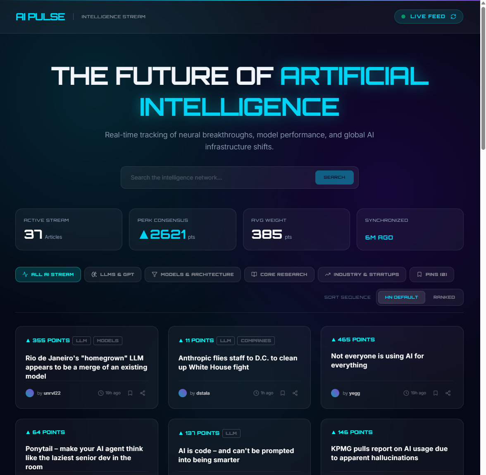

# AI Pulse — Live AI Intelligence Stream

AI Pulse is a real-time intelligence hub tracking the latest breakthroughs, models, research papers, startups, and AI innovations. By filtering and analyzing global developer consensus from live Hacker News streams, it indexes relevant frontier advancements every 5 minutes automatically.

The application is styled with the **Professional Polish** design theme, utilizing elegant glassmorphism (`glass-card`), high-contrast cyan accents (`#00FFFF`), deep twilight aesthetics, and fully responsive grid patterns.



## 🌟 Key Features

- **Live Hacker News Indexing**: Automatically fetches and parses top stories, indexing only those mentioning artificial intelligence, deep learning, LLMs, robotics, and other machine learning technologies.
- **Smart Categorization System**: Auto-classifies stories into focused sub-nodes:
  - **LLMs & GPT**: Large Language Models, prompt engineering, and conversational agents.
  - **Models & Architecture**: Open-weight models, transformer architectures, quantization techniques, and fine-tuning.
  - **Core Research**: Technical evaluation papers, academic research journals (`arXiv`), benchmarks, and algorithmic updates.
  - **Industry & Startups**: Tech giants, funding valuations, startups, and hardware deployments (e.g., NVIDIA Blackwell).
- **Consensus Rankings**: View and sort stories by curated Hacker News default order or ranked by developer consensus points.
- **Personal Local Database (Pins)**: Save, bookmark, and curate your own saved streams locally via standard client-side storage persistence (`localStorage`).
- **Real-Time Node Status**: Micro toast notifications and visual green pulse status indicators monitoring successful background updates.
- **Interactive Global Filters**: Live instant-search system matching title headers and author endpoints dynamically.

## 🛠️ Technology Stack

- **Framework**: React 18+ with TypeScript
- **Bundler**: Vite
- **Styling**: Tailwind CSS with custom theme utilities
- **Animations**: `motion` (by Framer Motion) for smooth staggering and entry transitions
- **Icons**: Lucide React
- **Data Source**: Live feeds from the official Firebase Hacker News API

## 📂 Project Structure

```text
├── .env.example          # Environment variable requirements
├── index.html            # Primary application entry point
├── metadata.json         # Shell metadata and frame capabilities
├── package.json          # Node dependencies and build sequences
├── README.md             # Project documentation (this file)
└── src/
    ├── App.tsx           # Main App containing layout state & dashboard
    ├── index.css         # Styling theme configuration and viewport rules
    ├── main.tsx          # React application bootstrapping
    ├── types.ts          # Strongly typed interfaces for HN Stories & categories
    ├── hooks/
    │   └── useBookmarks.ts  # State controller managing local pins database
    └── utils/
        ├── news.ts       # Hacker News fetching algorithms and keyword qualifiers
        └── time.ts       # Real-time relative human-readable timestamp conversions
```

## 🚀 Quick Start / Development

To start the local development server:

```bash
npm install
npm run dev
```

The application will run on `http://localhost:3000` (mapped via nginx reverse proxy).

To compile the application for production delivery:

```bash
npm run build
```
